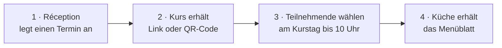

# Menüwahl Restaurant BAULÜÜT

Kursteilnehmende am Campus Sursee wählen ihr Mittagessen im Restaurant BAULÜÜT
**am Handy statt auf einem Papierblatt**. Dieses Repository enthält die
Webseite dafür und alle Anleitungen.

---

## So läuft es ab



1. **Die Réception legt einen Termin an**: pro Kurs und Essenstag einen. Dabei
   entsteht automatisch ein Zugangscode, zum Beispiel `M2VJ8KWS`.
2. **Der Kurs erhält einen Link oder ein Blatt mit QR-Code.** Niemand braucht
   ein Konto oder eine App.
3. **Die Teilnehmenden wählen am Kurstag bis 10:00 Uhr** Vorspeise, Hauptgang
   und geben Allergien an. Danach nimmt die Réception Änderungen entgegen.
4. **Die Réception druckt das Menüblatt** mit allen Bestellungen für die Küche.

Firmen, die oft am Campus sind, können einen **dauerhaften QR-Code** bekommen,
der für alle ihre Kurstage gilt.

---

## Die Webseite

| Seite | Adresse | Für wen |
|---|---|---|
| **Verwaltung** | [menue.campus-sursee.ch/admin](https://menue.campus-sursee.ch/admin) | Réception, mit Microsoft-Konto |
| Menüwahl | `https://menue.campus-sursee.ch/?klasse=CODE` | Teilnehmende, ohne Anmeldung |
| Menüwahl einer Firma | `https://menue.campus-sursee.ch/?firma=SCHLUESSEL` | Teilnehmende, ohne Anmeldung |
| Kursblatt mit QR-Code | `https://menue.campus-sursee.ch/kursblatt?klasse=CODE` | zum Aufhängen, ohne Anmeldung |
| Menüblatt für die Küche | `https://menue.campus-sursee.ch/menueblatt?klasse=CODE` | Réception, mit Microsoft-Konto |

Die Adressen mit `CODE` oder `SCHLUESSEL` muss niemand von Hand zusammensetzen:
Die Verwaltung erzeugt sie per Knopfdruck.

**Zum Ausprobieren ohne echte Daten** gibt es einen Testmodus, einfach
`?mock=1` anhängen:
[Verwaltung](https://menue.campus-sursee.ch/admin?mock=1) ·
[Menüwahl](https://menue.campus-sursee.ch/?mock=1) ·
[Kursblatt](https://menue.campus-sursee.ch/kursblatt?mock=1) ·
[Menüblatt](https://menue.campus-sursee.ch/menueblatt?mock=1).
Dort lässt sich alles anklicken; nichts wird gespeichert.

---

## Wo was liegt

Die Webseite selbst speichert nichts. Sie nutzt Dienste, die Campus Sursee
ohnehin hat:

| Was | Wo | Link |
|---|---|---|
| **Daten** (Termine, Bestellungen, Firmen) | SharePoint-Site «Reception», Listen «Klassen», «Bestellungen» und «Firmen» | [Site öffnen](https://campussursee.sharepoint.com/sites/hot-reze) · [Websiteinhalte (alle Listen)](https://campussursee.sharepoint.com/sites/hot-reze/_layouts/15/viewlsts.aspx) |
| **Automatische Abläufe** (Menüwahl ohne Anmeldung, Tagesmenüs holen, Daten nach 30 Tagen löschen) | Power Automate, Konto `powerplatform@campus-sursee.ch` | [Flows öffnen](https://make.powerautomate.com/environments/Default-2553fb74-5dcc-4072-8bb5-399d18f72af9/flows) |
| **Anmeldung und Zugriff** für die Réception | Entra ID, App «Menuewahl BAULUUT Admin» | [App-Registrierung](https://entra.microsoft.com/#view/Microsoft_AAD_RegisteredApps/ApplicationMenuBlade/~/Overview/appId/9d344eb0-8af8-44d1-ad64-916d564e5975) |
| **Webseite im Netz** | Cloudflare Pages, Projekt `baulueuet-menue` | [Cloudflare-Projekt](https://dash.cloudflare.com/?to=/:account/pages/view/baulueuet-menue) |
| **Quellcode und Anleitungen** | dieses Repository | [GitHub](https://github.com/CAMPUS-SURSEE/baulueuet-menue) |
| **Tagesmenüs** | Lunchgate, gepflegt vom Restaurant | – |

Zugangsdaten stehen bewusst **nicht** in diesem Repository.

---

## Anleitungen

| Ich möchte … | Dann lese ich … |
|---|---|
| das System an der Réception bedienen | [Anleitung für die Réception](anleitung/01_Anleitung_Reception.md) |
| eine Störung beheben | [Betriebshandbuch und Support](anleitung/02_Betriebshandbuch_Support.md) |
| verstehen, wie es technisch aufgebaut ist | [Technische Dokumentation](anleitung/03_Technische_Dokumentation.md) |
| etwas einrichten oder eine Änderung veröffentlichen | [Einrichtung und Veröffentlichung](anleitung/04_Einrichtung_und_Deployment.md) |
| wissen, warum etwas so gebaut ist | [Entscheide und Verlauf](anleitung/05_Entscheide_und_Verlauf.md) |
| den Code ändern | [Hinweise zum Quellcode](anleitung/06_Hinweise_Quellcode.md) |

---

## Aufbau des Repositorys

```
frontend/     die Webseite, genau so, wie sie im Netz steht
anleitung/    die Anleitungen oben
code/         kleiner Server zum Testen auf dem eigenen PC
Vorlagen/     das alte Papierblatt und das Logo, als Referenz
wrangler.toml Einstellungen für Cloudflare Pages
```

**Änderungen gehen automatisch live:** Was auf den Zweig `main` kommt, ist nach
etwa einer Minute auf der Webseite. Einzelheiten stehen in
[Einrichtung und Veröffentlichung](anleitung/04_Einrichtung_und_Deployment.md#4-eine-änderung-veröffentlichen).

---

## Zuständig

| Bereich | Wer |
|---|---|
| Termine, Links, Druckblätter | Réception |
| Inhalt der Tagesmenüs | Restaurant BAULÜÜT (über Lunchgate) |
| Webseite, SharePoint, Entra ID, Cloudflare | ICT-Services |
| Power-Automate-Flows | ICT-Services, Konto `powerplatform@campus-sursee.ch` |

**Stand:** 28.09.2026
