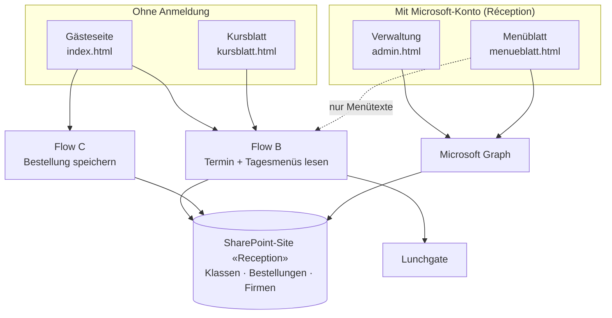

# Technische Dokumentation

Wie die Menüwahl aufgebaut ist: Architektur, Daten, Anmeldung, Schnittstellen.

**Stand:** 28.09.2026

---

## Inhalt

1. [Überblick](#1-überblick)
2. [Dateien](#2-dateien)
3. [Datenmodell](#3-datenmodell)
4. [Anmeldung und Berechtigungen](#4-anmeldung-und-berechtigungen)
5. [Datenzugriff über Microsoft Graph](#5-datenzugriff-über-microsoft-graph)
6. [Power Automate Flows](#6-power-automate-flows)
7. [Besondere Abläufe](#7-besondere-abläufe)
8. [Bibliotheken und Sicherheitsheader](#8-bibliotheken-und-sicherheitsheader)
9. [Lokal testen](#9-lokal-testen)
10. [Alle Kennungen auf einen Blick](#10-alle-kennungen-auf-einen-blick)

---

## 1. Überblick

Die Menüwahl ist eine **statische Webseite**: nur HTML, CSS und JavaScript, ohne
eigenen Server, ohne eigene Datenbank und ohne Bauprozess. Sie liegt bei
Cloudflare Pages. Die Daten stehen in drei SharePoint-Listen.



**Warum zwei Wege?** Kursteilnehmende und Kursleitungen haben kein Konto bei
Campus Sursee. Ihre Seiten laufen deshalb über zwei anonym erreichbare
Power-Automate-Flows. Die Réception hat ein Konto; ihre Seiten sprechen nach der
Anmeldung direkt mit SharePoint.

**Warum Flow B auch für das Menüblatt?** Die Lunchgate-Schnittstelle verlangt
Zugangsdaten und erlaubt keine Aufrufe aus dem Browser. Flow B ist darum die
einzige Stelle, die Tagesmenüs holt.

---

## 2. Dateien

Der Ordner `frontend/` ist genau das, was im Netz steht.

| Datei | Aufgabe | Anmeldung |
|---|---|---|
| [`index.html`](../frontend/index.html) | Gästeseite. Aufruf mit `?klasse=CODE` oder `?firma=SCHLUESSEL` | nein |
| [`admin.html`](../frontend/admin.html) | Verwaltung: Termine, Bestellungen, Reiter «Firmen» | ja |
| [`kursblatt.html`](../frontend/kursblatt.html) | Aushang mit QR-Code (`?klasse=CODE`); mit `?firma=…&name=…` Firmenblatt | nein |
| [`menueblatt.html`](../frontend/menueblatt.html) | Bestellübersicht für die Küche (`?klasse=CODE`) | ja |
| [`konfig.js`](../frontend/konfig.js) | alle Kennungen und Adressen. **Hier zuerst schauen** | |
| [`auth.js`](../frontend/auth.js) | Anmeldung, dünne Hülle um MSAL | |
| [`graph.js`](../frontend/graph.js) | Zugriff auf SharePoint, dazu Hilfen für Datum, Codes und Sprache | |
| [`_headers`](../frontend/_headers) | Sicherheitsheader und Content Security Policy | |

Jede Seite trägt HTML, CSS und JavaScript in **einer** Datei. Geteilt werden nur
die drei `.js`-Dateien, und diese lädt nur die Verwaltung, das Menüblatt und
das Kursblatt. **Die Gästeseite lädt keine davon** und hat ihre Einstellungen im
Kopf ihres eigenen Skripts.

**Gestaltung:** weiss und schlicht, Akzentfarbe Orange `#E8722A`,
Systemschriften, das Logo als eingebettetes SVG.

**Adressen ohne `.html`:** Cloudflare Pages leitet `/admin.html` auf `/admin`
um; die Abfrage (`?klasse=…`) bleibt dabei erhalten. Alte Links funktionieren
also weiter. Für die Anmeldung heisst das: In Entra ID müssen die Adressen ohne
`.html` eingetragen sein.

---

## 3. Datenmodell

Alle Listen liegen auf der SharePoint-Site **«Reception»**:
[campussursee.sharepoint.com/sites/hot-reze](https://campussursee.sharepoint.com/sites/hot-reze)
([Websiteinhalte](https://campussursee.sharepoint.com/sites/hot-reze/_layouts/15/viewlsts.aspx)).

Im Code und in SharePoint heisst ein Termin **«Klasse»**. In der Oberfläche
steht «Termin».

### Liste «Klassen» (Termine)

| Spalte | Typ | Inhalt |
|---|---|---|
| `Title` | Text | Kursname |
| `Firma` | Text | Auftraggeber |
| `Datum` | Datum | Kurstag (siehe [Datumsfalle](06_Hinweise_Quellcode.md#die-fallen-im-code)) |
| `Essenszeit` | Text | `HH:MM` |
| `Code` | Text | Zugangscode: acht Zufallszeichen (`M2VJ8KWS`) oder bei einem Firmen-Termin `SCHLUESSEL-JJMMTT` (`SORBA-K7M2-260914`) |
| `Status` | Auswahl | `offen` oder `geschlossen`. Die Verwaltung setzt beim Anlegen `offen` und fasst die Spalte danach nicht mehr an |
| `Teilnehmer` | Zahl | erwartete Teilnehmeranzahl. Leer heisst «unbekannt», nicht 0 |
| `Suppe`, `Salat`, `Menu1`, `Menu2`, `Dessert` | Text | Ersatzwerte, falls Lunchgate nichts liefert |

Eine allenfalls vorhandene Spalte `Sprache` wird nicht mehr benutzt und darf
entfernt werden.

### Liste «Bestellungen»

| Spalte | Typ | Inhalt |
|---|---|---|
| `Title` | Text | ohne Bedeutung; die Verwaltung schreibt beim Nacherfassen «Nachname Vorname» hinein |
| `KlasseID` | Zahl | Verweis auf den Termin. **Die einzige Zuordnung, die zählt** |
| `KlasseCode` | Text | Kopie des Codes, zum Suchen |
| `Vorname`, `Nachname` | Text | |
| `Vorspeise` | Auswahl | `Suppe`, `Salat` oder `Keine` |
| `Hauptgang` | Auswahl | `Menü 1` oder `Menü 2` |
| `Bemerkung` | Text | Allergien und Unverträglichkeiten, max. 200 Zeichen |

Die Liste hat **kein eigenes Datum**. Wird ein Termin gelöscht, bleiben seine
Bestellungen verwaist stehen, bis der Aufräum-Flow sie entfernt.

### Liste «Firmen» (Firmenverzeichnis)

| Spalte | Typ | Inhalt |
|---|---|---|
| `Title` | Text | Firmenname |
| `Schluessel` | Text | dauerhafter Schlüssel, zum Beispiel `SORBA-K7M2` |

Diese Liste wird **nie aufgeräumt**, weil gedruckte QR-Codes an den Schlüsseln
hängen. Termine übernehmen Firmenname und Code als eigene Kopie; Umbenennen oder
Löschen einer Firma ändert bestehende Termine nicht.

Die Liste darf fehlen: Dann steht im Terminformular nur «Firma frei eingeben»,
und der Reiter «Firmen» bietet an, sie anzulegen. Ist in `konfig.js` keine ID
eingetragen, sucht `graph.js` die Liste über ihren Namen «Firmen».

### Wer hat was angelegt?

Wer einen Termin oder eine Bestellung angelegt und zuletzt geändert hat, führt
SharePoint von selbst mit (`createdBy`, `lastModifiedBy` und die Zeitpunkte).
Die Verwaltung zeigt das als kleine graue Zeile. Es gibt dafür keine eigenen
Spalten.

---

## 4. Anmeldung und Berechtigungen

- **App-Registrierung** «Menuewahl BAULUUT Admin» in Entra ID,
  Client-ID `9d344eb0-8af8-44d1-ad64-916d564e5975`
  ([öffnen](https://entra.microsoft.com/#view/Microsoft_AAD_RegisteredApps/ApplicationMenuBlade/~/Overview/appId/9d344eb0-8af8-44d1-ad64-916d564e5975)).
- **Verfahren:** OAuth 2.0 mit PKCE über die Bibliothek MSAL. Plattform
  **Single-Page-Anwendung**, kein Clientgeheimnis.
- **Berechtigungen** (delegiert, mit Administratorzustimmung):
  `Sites.ReadWrite.All` und `User.Read`. *Delegiert* heisst: Die Seite kann nur,
  was die angemeldete Person in SharePoint ohnehin darf.
- **Zugangskontrolle:** In der Unternehmensanwendung ist «Zuweisung erforderlich»
  eingeschaltet; nur zugewiesene Personen kommen hinein.
- **Token** liegen im `sessionStorage` des Tabs. Aus der Verwaltung geöffnete
  Tabs erben sie, deshalb verlangt das Menüblatt keine zweite Anmeldung.

Client-ID und Mandanten-ID stehen offen im Quelltext. Das ist bei
Single-Page-Anwendungen so vorgesehen: Es sind Kennungen, keine Geheimnisse.

`auth.js` bietet vier Funktionen: `Auth.anmeldungSicherstellen()`,
`Auth.token()`, `Auth.konto()` und `Auth.abmelden()`.

Einrichtung Schritt für Schritt: [Einrichtung, Abschnitt 2](04_Einrichtung_und_Deployment.md#2-app-registrierung-in-entra-id).

---

## 5. Datenzugriff über Microsoft Graph

Alle Zugriffe auf SharePoint laufen über [`graph.js`](../frontend/graph.js). Die
Seiten sprechen nie direkt mit Graph.

| Bereich | Funktionen |
|---|---|
| Termine | `Graph.klassen()`, `klasseNachCode()`, `klasseAnlegen()`, `klasseAendern()`, `klasseLoeschen()` |
| Bestellungen | `Graph.bestellungen()`, `bestellungAnlegen()`, `bestellungAendern()`, `bestellungLoeschen()`, `zaehler()` |
| Firmen | `Graph.firmenListeErmitteln()`, `firmenListeAnlegen()`, `firmenLaden()`, `firmaAnlegen()`, `firmaAendern()` (nur Name), `firmaLoeschen()` |
| ohne Anmeldung, über Flow B | `Graph.klasseOeffentlich()`, `menuetexte()` |
| Hilfen (`Hilfe.…`) | Datum umrechnen und formatieren, Codes und Firmenschlüssel bilden, Links bauen, Sprache, Annahmeschluss |

Jede Funktion ist im Quelltext kommentiert.

**Endpunkte:** `GET`, `POST`, `PATCH` und `DELETE` auf
`/v1.0/sites/{siteId}/lists/{listId}/items`. Dazu, nur für die Liste «Firmen»,
`GET /lists` (Liste über den Namen finden) und `POST /lists` (Liste anlegen).

**Zwei bewusste Entscheide:**

- **Immer die ganze Liste holen und im Browser filtern.** Filter auf
  SharePoint-Spalten brauchen einen Index und scheitern sonst sporadisch. Dank
  30 Tagen Aufbewahrung sind es nur wenige hundert Einträge.
- **Rückfall bei der Feldauswahl.** Scheitert eine Abfrage mit HTTP 400 (etwa
  weil eine Spalte fehlt), wiederholt `graph.js` sie ohne Feldauswahl. Lesen
  klappt dann weiter; **Schreiben** in eine fehlende Spalte scheitert aber.

Fehler übersetzt `graph.js` in Klartext: 401 = Anmeldung abgelaufen, 403 = kein
Zugriff auf die Site, 404 = falsche ID in `konfig.js`, 429 = zu viele Anfragen.

---

## 6. Power Automate Flows

Alle Flows laufen unter `powerplatform@campus-sursee.ch` in der Umgebung
`Default-2553fb74-5dcc-4072-8bb5-399d18f72af9`
([Flows öffnen](https://make.powerautomate.com/environments/Default-2553fb74-5dcc-4072-8bb5-399d18f72af9/flows)).

| Flow | Aufgabe | Aufgerufen von |
|---|---|---|
| **API Klasse laden** (Flow B) | GET: Termin und Tagesmenüs zu einem Code | Gästeseite, Kursblatt, Menüblatt (nur Menütexte) |
| **API Bestellung speichern** (Flow C) | POST: eine Bestellung speichern | nur Gästeseite |
| **Aufraeumen Menuewahl** | täglich 03:00: Termine und Bestellungen löschen, die älter als 30 Tage sind | Zeitplan ([öffnen](https://make.powerautomate.com/environments/Default-2553fb74-5dcc-4072-8bb5-399d18f72af9/flows/063e1fa8-494b-4274-9402-608e88d59889/details)) |

Die Aufrufadressen (mit Signatur) stehen in `konfig.js` und im Kopf von
`index.html`, nicht in der Dokumentation.

**Antwort von Flow B:**

```json
{"ok":true,"offen":true,"klasse":"…","firma":"…","datum":"2026-08-28",
 "datumText":"Freitag, 28.08.2026","essenszeit":"12:00",
 "suppe":"…","salat":"…","menu1":"…","menu2":"…","dessert":"…"}
```

**Lunchgate in Flow B:**

- Abfrage `GET https://api2.lunchgate.ch/restaurant/menu?restaurant_id=5081&response=json`
  mit Basic Authentication. **Kein `&limit=1` anhängen**, sonst fehlen Menü 2,
  Vorspeisen und Dessert.
- `key_0` = Menü 1, `key_1` = Menü 2, `key_2.line2` = Vorspeisen,
  `key_2.line3` = Dessert.
- Die Vorspeisenzeile wird am Wort « oder » in Suppe und Salat geteilt. Das ist
  fragil, wenn die Küche anders schreibt.
- Liefert Lunchgate nichts, nimmt Flow B die Ersatzspalten des Termins.

**Achtung beim Bearbeiten im Designer:** Er meldet Ausdrücke oft fälschlich als
ungültig und verliert Änderungen still. Nach jeder Änderung in der
**Codeansicht** der Aktion prüfen. Ein nie gespeicherter Entwurf ist verloren.

---

## 7. Besondere Abläufe

### 7.1 Kursblatt ohne Anmeldung

Das Kursblatt lädt seine Daten über Flow B, damit die Réception den Link auch
einer externen Kursleitung schicken kann. Es zeigt nur Kursname, Firma, Datum
und Essenszeit, also was ohnehin auf dem Aushang steht, und nur mit gültigem
Code. Bestellungen liefert Flow B nicht.

Antwortet Flow B nicht, bietet die Fehlerkarte den Knopf «Mit Konto anmelden».
Erst dann läuft der Weg über Graph. Deshalb bleibt `kursblatt` in der
App-Registrierung eingetragen.

### 7.2 Sprache

Kursblatt und Gästeseite gibt es auf Deutsch, Englisch und Französisch. Die
Sprache **reist im Link mit** (`&en`, `&fr`; ohne Zusatz Deutsch) und wird nicht
gespeichert. Die Réception wählt sie beim Öffnen des Kursblatts; der QR-Code
übernimmt sie. Auf der Gästeseite lässt sie sich mit DE / EN / FR umstellen.

Übersetzt sind nur die Beschriftungen. Die Menütexte aus Lunchgate und das
Menüblatt für die Küche bleiben deutsch. Die Texte stehen je Seite im Objekt
`TEXTE` mit den Schlüsseln `de`, `fr`, `en`.

### 7.3 Annahmeschluss 10:00 Uhr

Die Gästeseite lässt Bestellen und Ändern nur bis 10:00 Uhr am Kurstag zu. Sie
prüft beim Laden, beim Anzeigen der Bestätigung und nochmals beim Absenden; ein
Timer schaltet eine offene Seite um 10:00 von selbst um.

- Die Prüfung läuft **im Browser**, nicht in Flow C. Das genügt für den Zweck
  (verlässliche Zahlen für die Küche). Soll die Frist hart gelten, müsste Flow C
  vor dem Speichern die Uhrzeit prüfen und mit HTTP 403 antworten; die
  Gästeseite zeigt dann bereits «Bestellung geschlossen».
- **Die Verwaltung kennt keine Frist.** Sie schreibt direkt über Graph.
- Die Stunde steht an **zwei Stellen**: `annahmeschluss` in `konfig.js` und
  `ANNAHMESCHLUSS` in `index.html`.

### 7.4 Dauerhafter Firmen-QR-Code

Eine Firma im Verzeichnis hat einen festen **Schlüssel**: Firmenname in
Grossbuchstaben (höchstens 10 Zeichen, Umlaute aufgelöst), Bindestrich, vier
Zufallszeichen. Beispiel: «Müller AG» → `MUELLERAG-X4PQ`. Der Zufallsteil
verhindert, dass man den Link einer Firma erraten kann.

Ein Termin dieser Firma erhält den Code **Schlüssel + Kurstag**:

```
SORBA-K7M2  +  2026-09-14   →   SORBA-K7M2-260914
```

Der dauerhafte Link `/?firma=SORBA-K7M2` führt auf die Gästeseite. Diese bildet
aus Schlüssel und heutigem Datum den Code und fragt Flow B **wie bei jedem
anderen Code**. Die Flows wissen von Firmen nichts.

Regeln, die daraus folgen:

- Pro Firma und Kurstag nur **ein** Firmen-Termin (die Verwaltung prüft das).
- Verschiebt man einen Firmen-Termin, **ändert sich sein Code**. Das ist die
  einzige Stelle, an der sich ein Code je ändert.
- Einen Firmen-Code erkennt man am **Bindestrich**; Zufallscodes haben nie einen.
- Das **Firmenblatt** (`kursblatt.html?firma=…&name=…`) braucht keinen
  Netzaufruf; der Name reist im Link mit.

---

## 8. Bibliotheken und Sicherheitsheader

**Bibliotheken**, beide von `cdn.jsdelivr.net`, auf eine feste Version
festgelegt und mit Prüfsumme (`integrity="sha384-…"`) abgesichert:

| Bibliothek | Version | Wofür | Eingebunden in |
|---|---|---|---|
| `@azure/msal-browser` | 4.30.0 | Anmeldung | `admin.html`, `menueblatt.html`, `kursblatt.html` |
| `qrcode-generator` | 1.4.4 | QR-Code | `kursblatt.html` |

Version anheben: [Einrichtung, Abschnitt 5](04_Einrichtung_und_Deployment.md#5-bibliotheksversion-anheben).

**Sicherheitsheader** in [`frontend/_headers`](../frontend/_headers), dort mit
Begründung je Regel. Die Content Security Policy erlaubt nur, was gebraucht wird:

| Regel | Erlaubt | Wofür |
|---|---|---|
| `script-src` | eigene Seite, inline, `cdn.jsdelivr.net` | Skripte der Seiten und die zwei Bibliotheken |
| `connect-src` | Graph, `login.microsoftonline.com`, Power-Automate-Host | Daten und Anmeldung |
| `frame-src` | `login.microsoftonline.com` | stille Erneuerung der Anmeldung |
| `img-src` | eigene Seite, `data:`, `baulueuet.ch` | QR-Code und Favicon |

Ändert sich eine dieser Adressen (zum Beispiel ein neuer Flow), muss sie in
`_headers` nachgeführt werden. **Sonst blockiert der Browser still**, und die
Seite bleibt ohne Meldung leer.

---

## 9. Lokal testen

Auf Windows, ohne Installation:

```
powershell -ExecutionPolicy Bypass -File code\serve.ps1
```

Oder mit Python, auf jedem System:

```
python -m http.server 8123 --directory frontend
```

Danach läuft die Seite auf `http://localhost:8123/`. Mit **`?mock=1`** zeigt
jede Seite Beispieldaten, ohne Anmeldung und ohne Netz:

| Adresse | Zeigt |
|---|---|
| `/admin.html?mock=1` | Verwaltung mit Beispielterminen und zwei Firmen; Anlegen, Ändern, Löschen funktionieren im Speicher |
| `/index.html?mock=1` | Gästeseite |
| `/index.html?mock=1&falschertag=1` | Gästeseite am falschen Tag |
| `/index.html?mock=1&spaet=1` bzw. `&spaet=0` | nach bzw. vor 10:00 Uhr |
| `/index.html?mock=1&keinkurs=1` | Firmen-QR-Code ohne Termin: «Kein Kurs gefunden» |
| `/kursblatt.html?mock=1` | Kursblatt |
| `/kursblatt.html?firma=SORBA-K7M2&name=SORBA` | Firmenblatt (braucht kein `mock`) |
| `/menueblatt.html?mock=1` | Menüblatt mit acht Bestellungen |

Für Tests **mit** echter Anmeldung müssen die `localhost:8123`-Adressen in der
App-Registrierung eingetragen sein.

---

## 10. Alle Kennungen auf einen Blick

| Was | Wert |
|---|---|
| Webseite | [menue.campus-sursee.ch](https://menue.campus-sursee.ch) |
| Repository | [github.com/CAMPUS-SURSEE/baulueuet-menue](https://github.com/CAMPUS-SURSEE/baulueuet-menue) |
| Cloudflare-Pages-Projekt | [`baulueuet-menue`](https://dash.cloudflare.com/?to=/:account/pages/view/baulueuet-menue) |
| SharePoint-Site | [campussursee.sharepoint.com/sites/hot-reze](https://campussursee.sharepoint.com/sites/hot-reze) |
| Site-ID | `campussursee.sharepoint.com,141d7dcf-e2f2-4273-8b14-af04a092ccb8,ac91aebb-2f75-4dd3-bdc4-6b26858f1d2b` |
| Liste «Klassen» | `966a62ea-0ec5-4054-80a2-9a52d7b32483` |
| Liste «Bestellungen» | `19bef1ed-a806-4a5b-bdb5-c869f7d2a582` |
| Liste «Firmen» | `6f61962a-5763-4650-ba1d-d45b30a9b6f6` |
| Mandanten-ID | `2553fb74-5dcc-4072-8bb5-399d18f72af9` |
| Client-ID der App | [`9d344eb0-8af8-44d1-ad64-916d564e5975`](https://entra.microsoft.com/#view/Microsoft_AAD_RegisteredApps/ApplicationMenuBlade/~/Overview/appId/9d344eb0-8af8-44d1-ad64-916d564e5975) |
| Power-Automate-Umgebung | [`Default-2553fb74-5dcc-4072-8bb5-399d18f72af9`](https://make.powerautomate.com/environments/Default-2553fb74-5dcc-4072-8bb5-399d18f72af9/flows) |
| Aufräum-Flow | `063e1fa8-494b-4274-9402-608e88d59889` |
| Lunchgate | `restaurant_id` 5081 |
| Testtermin | Code `TEST1234` |
| Alte Power App (abgelöst) | `5994926d-2710-4847-9482-ed976014a26c` |

Zugangsdaten und signierte Flow-Adressen stehen bewusst nicht hier.
